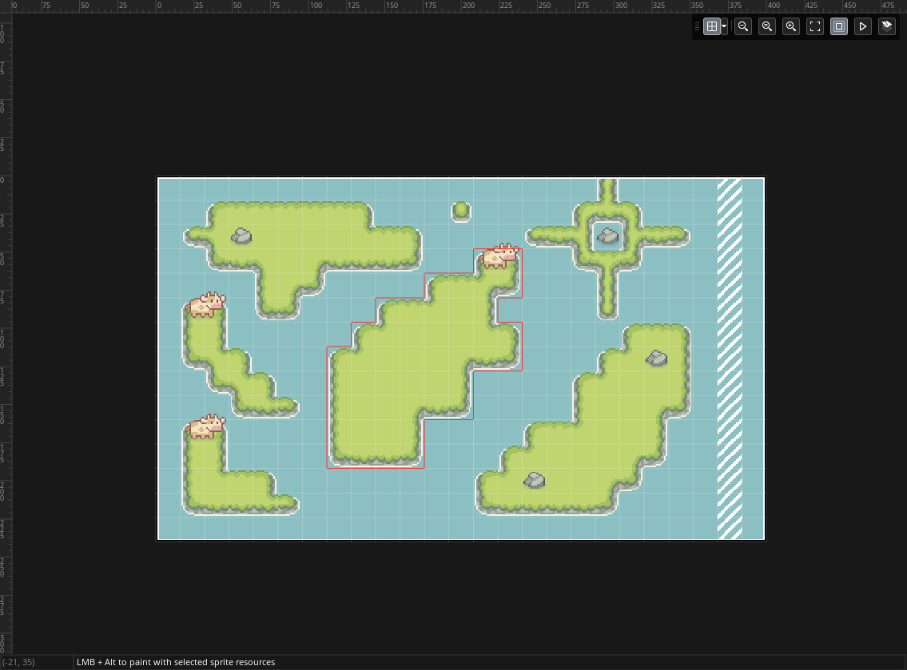
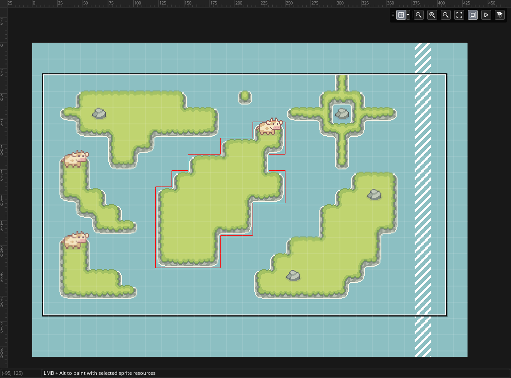

# YellowAfterlife's room-shifter
Resizes and/or moves the contents of GameMaker (LTS / GM2022+) rooms.

Mostly exists to help with the specific problem of "I want to resize my room towards top/left without moving my layers by hand". If you know, you know.

| [](media/before.png) | [](media/after.png) |
| - | - |

Don't forget to backup your project before using the tool!

Also see: [Suggestion on GameMaker bug tracker](https://github.com/YoYoGames/GameMaker-Bugs/issues/3225)

## Use ([web version](https://yal.cc/tools/gm/room-shifter/))
You specify how you want your rooms to be resized,
specify _which_ rooms you want resized,
choose your project directory,
press the "Modify rooms" button,
and get a set of changed files in a ZIP!

You can then close your project in GM,
extract these in the project directory (overwriting as necessary),
and open it again.

The tool works client-side so you can save the page for offline use.

## Setup (CLI)
CLI version is for people that might need to do this often (?).
1. Install [Neko VM](https://nekovm.org/download/)
2. Place `room-shift.n` somewhere (if you downloaded a standalone Neko VM ZIP, you can put it in Neko directory)

## Use (CLI)
Open command prompt/terminal in the directory with Neko and/or `room-shift.n` and do:
```
neko room-shift.n --project path/to/project.yyp <...options> <...rooms>
```
**Options** can be:

| Option | Argument | Description |
| --: | :-- | :-- |
| `--project` | path | **Required!** Path to a GameMaker project to work with
| `--left` | number | Number of pixels to add to the left
| `--top` | number | Number of pixels to add to the top
| `--right` | number | Number of pixels to add to the right
| `--bottom` | number | Number of pixels to add to the bottom
| `--width` | number | New room width
| `--halign` | align | Alignment for original contents when using `--width`
| `--height` | number | New room height
| `--valign` | align | Alignment for original contents when using `--height`

**Path** can be a relative or absolute path to a YYP

`--width` and `--height` override left/top/right/bottom arguments,
calculating them on per-room basis based on alignment.

**Align**-typed arguments can be:
- `left`, `center`, `right` (horizontal)
- `top`, `middle`, `bottom` (vertical)
- A number (0.0 is left/top, 2.0 is right/bottom, fractions are allowed)

**Rooms** can be:
- Room names (e.g. `Room1`)
- Wildcard names
	- `rm_stage_*` matches anything starting with `rm_stage_`\
	  This would match `rm_stage_1` or `rm_stage_1_boss`
	- `rm_stage_#` matches anything starting with `rm_stage_` _and followed by a number_\
	  This would match `rm_stage_1`, but not `rm_stage_1_boss` (but `rm_stage_#_boss` would)

### Examples
```
neko bin/room-shift.n --project room-shift-test-2024/room-shift-test-2024.yyp --left 16 --top 32 --right 64 --bottom 48 Room1
```
This would expand Room1 by 16 pixels on the left, 32 pixels on the top,
64 pixels on the right, and 48 pixels on the bottom.
```
neko bin/room-shift.n --project room-shift-test-2024/room-shift-test-2024.yyp --width 2048 --height 2048 --halign center --valign middle Room1 Room2
```
This would resize Room1 and Room2 to 2048x2048, placing the original contents in the middle.

## Building

1. Install [Haxe](https://haxe.org)  
   v4.3.6 was used as of writing.
2. Download and unzip or "clone" (using git) the repository
3. Open command prompt/terminal in the directory (where this `README` is)
4. `haxe build-neko.hxml`

If all is well, `room-shift.n` should appear in the directory.

If you made changes, you can re-compile the JS file for the web version using `haxe build.js.hxml`

## Known issues

1. Not actively tested with making rooms _smaller_.
1. Resizing a room multiple times might leave redundant tile columns/rows  
   (which GameMaker will usually clean up on load)
1. GameMaker will usually re-format the room's .yy file when you open it.  
   This is to be expected - it's hard to perfectly match the format.